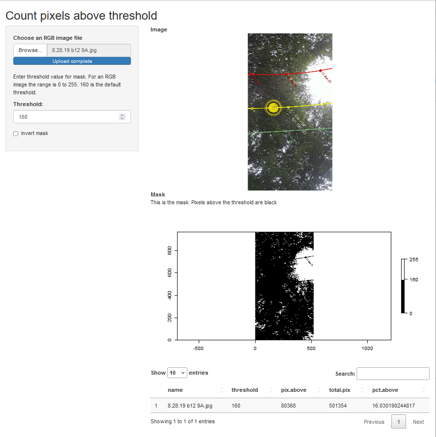

# image_threshold
This was for a project to estimate shade. 
Take a picture of the sky under sume structures (trees)
this app will thrshold the brightest pixels so you can estimate
relative amount os sky pixels vs obstructions.

